# ADP Green Energies — Internal App: Database Schema

**Target DB:** PostgreSQL 15+
**Date:** 2026-07-15
**Source:** Paper workflow notes (Papers 1–5)

---

## 1. Overview

Internal workflow app for managing rooftop-solar consumer projects end-to-end:
lead capture → document collection/verification → discom formalities (name correction,
ownership transfer, commercial→domestic conversion) → registration (PM Surya Ghar / PMSGY) →
loan processing → installation → net metering → commissioning → subsidy disbursal → handover.

### 1.1 Roles (5 views)

| Role | Access | Responsibility |
|---|---|---|
| `agent` | Base level — available to **all** users regardless of role | Creates consumer leads, collects KYC + land + bank documents, uploads photos/bills |
| `site_manager` | Role view | Material delivery, installation progress (weighted checklist), site photos/videos, DCR numbers |
| `doc_team` | Role view | Verifies uploaded documents, raises **Action Required**, drives discom/registration statuses |
| `accounts` | Reserved role | Payments — processing fee, security deposit, loan tracking, subsidy (CFA/SFA) disbursal |
| `admin` | Reserved — company head only | Full visibility, user/role management, master data (area blocks), overrides |

> Every user gets the Agent view by default; the other four views unlock per role.
> Admin ⊇ all views.

---

## 2. Entity-Relationship Diagrams

> **Start with §2.1–§2.3 when explaining the system to someone** — they show the shape
> of the data without the noise. The full column-by-column ERD is kept in §2.4 as a reference.
> All rendered PNGs live in [diagrams/](diagrams/), with editable mermaid sources (`.mmd`) beside them.
> Canonical Mermaid sources used for rendering: `overview.mmd`, `journey.mmd`,
> `module-1-lead.mmd`, `module-2-docs.mmd`, `module-3-installation.mmd`,
> `module-4-money.mmd`, `er-diagram-full.mmd`, `er-diagram-roles.mmd`.

### 2.1 Big picture — how the tables connect

One box per table, no columns. Two hubs: **`consumers`** (everything the agent captures)
and **`projects`** (everything the workflow tracks). Everything else hangs off one of the two.

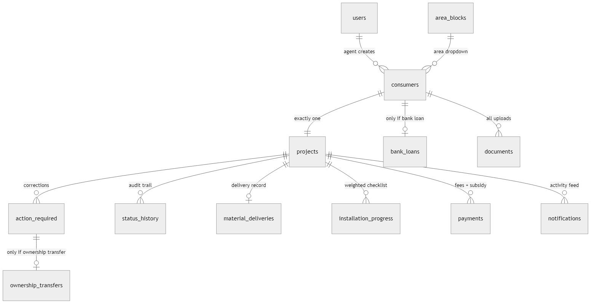

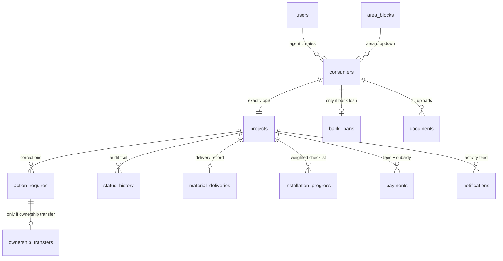

### 2.2 Consumer journey — the workflow in 6 stages

The same pipeline as the `project_status` enum, but told as a story:
agent captures → doc team verifies (with the Action-Required loop) → registration →
loan (if applicable) → installation → commissioning → subsidy & handover.

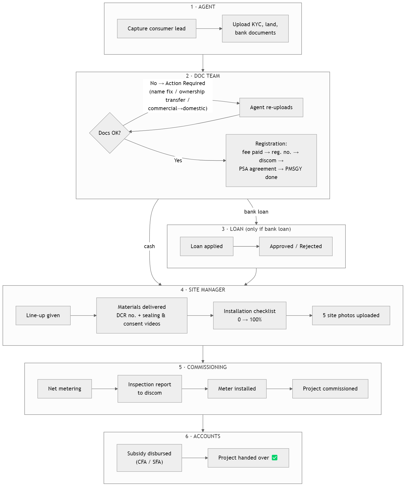

### 2.3 Module diagrams — one small ERD per role

Each diagram shows only the tables that role touches, with only the columns worth
explaining (full column lists are in §4).

**Module 1 · Lead capture (Agent):** an agent creates consumers inside an area block;
a bank-loan record exists only when `payment_mode = 'bank_loan'`.

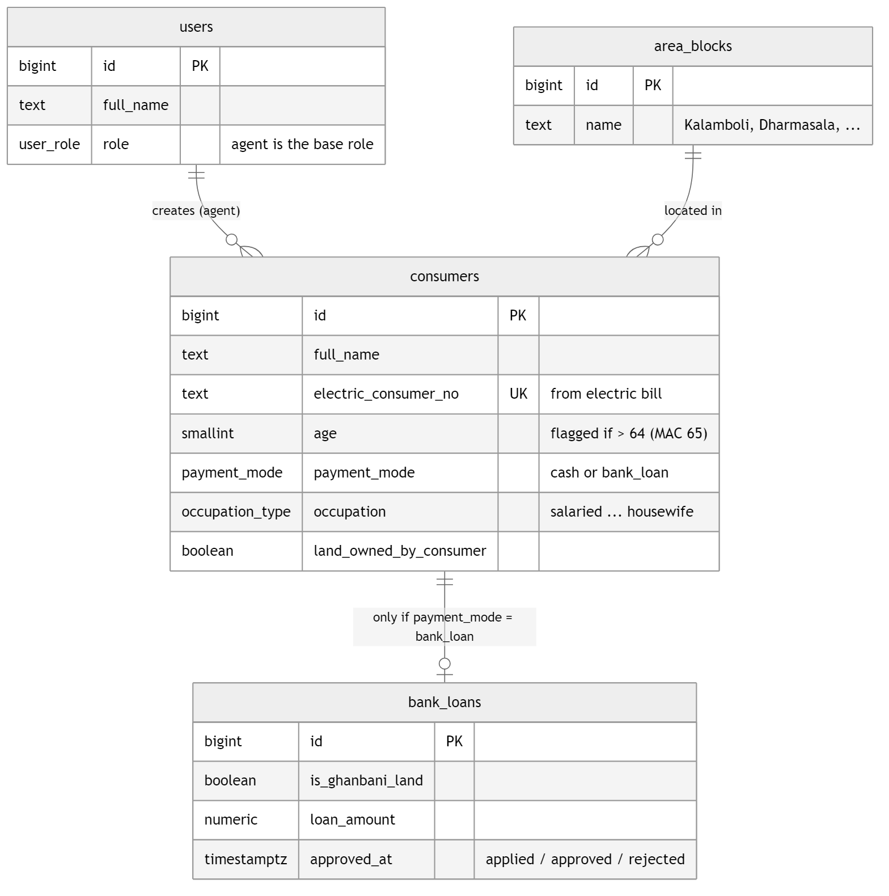

**Module 2 · Documents & verification (Doc Team):** every upload is a `documents` row;
the doc team verifies or raises `action_required`; ownership-transfer cases get a detail record.

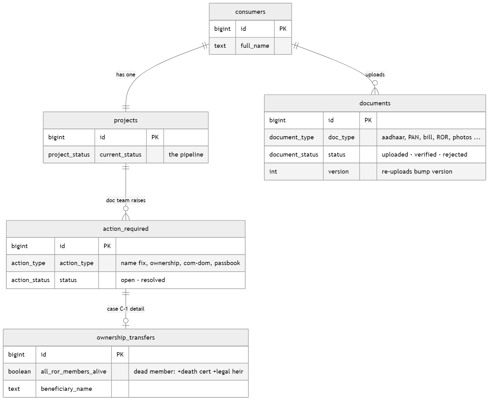

**Module 3 · Installation (Site Manager):** one delivery record per project, plus the
10-item weighted checklist whose done-weights add up to the installation percentage.

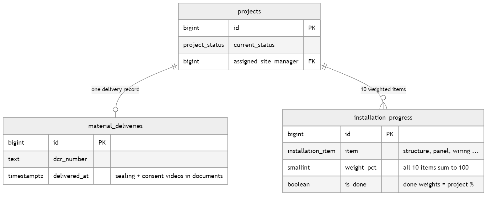

**Module 4 · Money & tracking (Accounts / Admin):** payments, the append-only status
audit trail, and the notification feed.

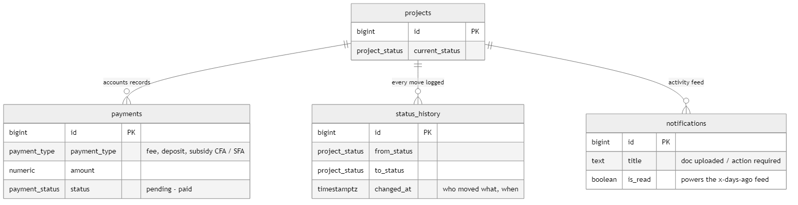

### 2.4 Full ER diagram (reference — every column)

> ⚠️ Dense by design — use it to look things up, not to present.
> Also available as a zoomable [SVG](diagrams/er-diagram-full.svg).

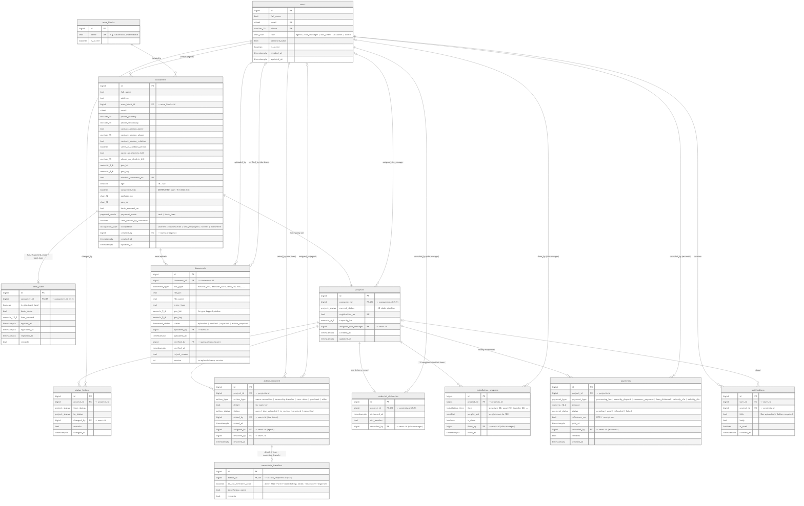

```mermaid
erDiagram
    users {
        bigint id PK
        text full_name
        citext email UK
        varchar_15 phone UK
        user_role role "agent | site_manager | doc_team | accounts | admin"
        text password_hash
        boolean is_active
        timestamptz created_at
        timestamptz updated_at
    }

    area_blocks {
        bigint id PK
        text name UK "e.g. Kalamboli, Dharmasala"
        boolean is_active
    }

    consumers {
        bigint id PK
        text full_name
        text address
        bigint area_block_id FK "-> area_blocks.id"
        citext email
        varchar_15 phone_primary
        varchar_15 phone_secondary
        text contact_person_name
        varchar_15 contact_person_phone
        text contact_person_relation
        boolean same_as_contact_person
        text name_on_electric_bill
        varchar_15 phone_on_electric_bill
        numeric_9_6 geo_lat
        numeric_9_6 geo_lng
        text electric_consumer_no UK
        smallint age "18..120"
        boolean surpassed_mac "GENERATED: age > 64 (MAC 65)"
        char_12 aadhaar_no
        char_10 pan_no
        text bank_account_no
        payment_mode payment_mode "cash | bank_loan"
        boolean land_owned_by_consumer
        occupation_type occupation "salaried | businessman | self_employed | farmer | housewife"
        bigint created_by FK "-> users.id (agent)"
        timestamptz created_at
        timestamptz updated_at
    }

    bank_loans {
        bigint id PK
        bigint consumer_id FK, UK "-> consumers.id (1:1)"
        boolean is_ghanbani_land
        text bank_name
        numeric_12_2 loan_amount
        timestamptz applied_at
        timestamptz approved_at
        timestamptz rejected_at
        text remarks
    }

    projects {
        bigint id PK
        bigint consumer_id FK, UK "-> consumers.id (1:1)"
        project_status current_status "~40-state pipeline"
        text registration_no UK
        numeric_6_2 capacity_kw
        bigint assigned_site_manager FK "-> users.id"
        timestamptz created_at
        timestamptz updated_at
    }

    documents {
        bigint id PK
        bigint consumer_id FK "-> consumers.id"
        document_type doc_type "electric_bill, aadhaar_card, land_ror, noc, ..."
        text file_url
        text file_name
        text mime_type
        numeric_9_6 geo_lat "for geo-tagged photos"
        numeric_9_6 geo_lng
        document_status status "uploaded | verified | rejected | action_required"
        bigint uploaded_by FK "-> users.id"
        timestamptz uploaded_at
        bigint verified_by FK "-> users.id (doc team)"
        timestamptz verified_at
        text reject_reason
        int version "re-uploads bump version"
    }

    status_history {
        bigint id PK
        bigint project_id FK "-> projects.id"
        project_status from_status
        project_status to_status
        bigint changed_by FK "-> users.id"
        text remarks
        timestamptz changed_at
    }

    action_required {
        bigint id PK
        bigint project_id FK "-> projects.id"
        action_type action_type "name correction | ownership transfer | com->dom | passbook | other"
        text detail "for name of <text>"
        action_status status "open | doc_uploaded | in_review | resolved | cancelled"
        bigint raised_by FK "-> users.id (doc team)"
        timestamptz raised_at
        bigint assigned_to FK "-> users.id (agent)"
        bigint resolved_by FK "-> users.id"
        timestamptz resolved_at
    }

    ownership_transfers {
        bigint id PK
        bigint action_id FK, UK "-> action_required.id (1:1)"
        boolean all_ror_members_alive "alive: NOC+Form1+undertaking; dead: +death cert+legal heir"
        text beneficiary_name
        text remarks
    }

    material_deliveries {
        bigint id PK
        bigint project_id FK, UK "-> projects.id (1:1)"
        timestamptz delivered_at
        text dcr_number
        bigint recorded_by FK "-> users.id (site manager)"
    }

    installation_progress {
        bigint id PK
        bigint project_id FK "-> projects.id"
        installation_item item "structure 30, panel 10, inverter 20, ..."
        smallint weight_pct "weights sum to 100"
        boolean is_done
        bigint done_by FK "-> users.id (site manager)"
        timestamptz done_at
    }

    payments {
        bigint id PK
        bigint project_id FK "-> projects.id"
        payment_type payment_type "processing_fee | security_deposit | consumer_payment | loan_disbursal | subsidy_cfa | subsidy_sfa"
        numeric_12_2 amount
        payment_status status "pending | paid | refunded | failed"
        text reference_no "UTR / receipt no."
        timestamptz paid_at
        bigint recorded_by FK "-> users.id (accounts)"
        text remarks
        timestamptz created_at
    }

    notifications {
        bigint id PK
        bigint user_id FK "-> users.id"
        bigint project_id FK "-> projects.id"
        text title "Doc uploaded / Action required"
        text body
        boolean is_read
        timestamptz created_at
    }

    %% ---- relationships ----
    users        ||--o{ consumers            : "creates (agent)"
    area_blocks  ||--o{ consumers            : "located in"
    consumers    ||--o| bank_loans           : "has, if payment_mode = bank_loan"
    consumers    ||--|| projects             : "has exactly one"
    consumers    ||--o{ documents            : "owns uploads"
    users        ||--o{ documents            : "uploaded_by"
    users        |o--o{ documents            : "verified_by (doc team)"
    projects     ||--o{ status_history       : "logs transitions"
    users        ||--o{ status_history       : "changed_by"
    projects     ||--o{ action_required      : "corrections raised"
    users        ||--o{ action_required      : "raised_by (doc team)"
    users        |o--o{ action_required      : "assigned_to (agent)"
    action_required ||--o| ownership_transfers : "detail, if type = ownership_transfer"
    projects     ||--o| material_deliveries  : "one delivery record"
    users        ||--o{ material_deliveries  : "recorded_by (site manager)"
    projects     ||--o{ installation_progress : "10 weighted checklist items"
    users        |o--o{ installation_progress : "done_by (site manager)"
    projects     ||--o{ payments             : "money movements"
    users        ||--o{ payments             : "recorded_by (accounts)"
    users        ||--o{ notifications        : "receives"
    projects     |o--o{ notifications        : "about"
    users        |o--o{ projects             : "assigned_site_manager"
```

### 2.5 Cardinality summary

| Relationship | Cardinality | Rule |
|---|---|---|
| `users` → `consumers` | 1 : N | An agent creates many consumer leads |
| `area_blocks` → `consumers` | 1 : N | Dropdown block; every consumer belongs to one block |
| `consumers` → `projects` | 1 : 1 | Every consumer has exactly one project |
| `consumers` → `bank_loans` | 1 : 0..1 | Only when `payment_mode = 'bank_loan'` |
| `consumers` → `documents` | 1 : N | All uploads (KYC, land, loan, site photos/videos) |
| `projects` → `status_history` | 1 : N | Append-only audit of every pipeline move |
| `projects` → `action_required` | 1 : N | Doc team can raise multiple corrections |
| `action_required` → `ownership_transfers` | 1 : 0..1 | Only when `action_type = 'ownership_transfer'` |
| `projects` → `material_deliveries` | 1 : 0..1 | One delivery record per project |
| `projects` → `installation_progress` | 1 : 10 | One row per weighted checklist item |
| `projects` → `payments` | 1 : N | Processing fee, security deposit, subsidy CFA/SFA, … |
| `users` → `notifications` | 1 : N | Activity feed ("x days ago") |

### 2.6 Tables grouped by owning role

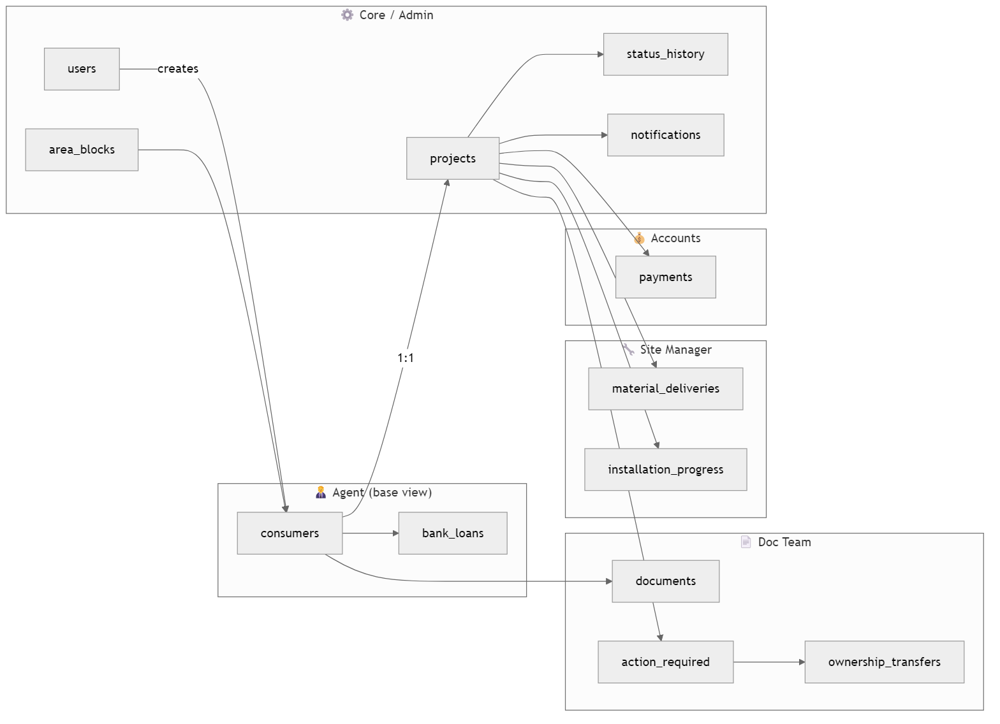

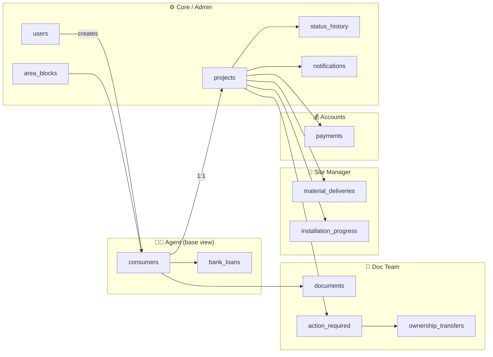

---

## 3. Enums

```sql
-- Who a user is
CREATE TYPE user_role AS ENUM (
  'agent',          -- base level, everyone
  'site_manager',
  'doc_team',
  'accounts',
  'admin'
);

-- How the consumer pays
CREATE TYPE payment_mode AS ENUM ('cash', 'bank_loan');

-- Consumer occupation (Paper 1)
CREATE TYPE occupation_type AS ENUM (
  'salaried',
  'businessman',
  'self_employed',
  'farmer',
  'housewife'
);

-- Every document the app collects (Papers 1, 2, 4)
CREATE TYPE document_type AS ENUM (
  -- Agent-collected KYC / consumer docs
  'electric_bill',
  'aadhaar_card',
  'pan_card',
  'bank_passbook',
  'roof_geotagged_photo',
  -- Land documents (any one of)
  'land_ror',                    -- Record of Rights
  'sale_deed',
  'malgujani',                   -- municipality tax receipt
  -- Bank-loan docs (Paper 2)
  'bank_statement_6m',
  'salary_slip',
  'it_return',
  -- Ownership-transfer docs (Paper 2, doc team)
  'beneficiary_aadhaar',
  'noc',                         -- No Objection Certificate (required)
  'form_1',
  'self_undertaking',
  'death_certificate',           -- if a member on ROR is deceased
  'legal_heir_certificate',      -- if a member on ROR is deceased
  -- Site-manager uploads (Paper 4)
  'material_sealing_video',
  'customer_consent_video',
  'plant_geotagged_photo',
  'inverter_serial_photo',
  'inverter_setup_photo',
  'earthing_photo',
  'la_photo',                    -- Lightning Arrester
  -- Doc-team / discom artifacts
  'inspection_report',
  'psa_agreement',
  'net_metering_agreement',
  'other'
);

CREATE TYPE document_status AS ENUM (
  'uploaded',        -- agent/site manager uploaded, awaiting doc team
  'verified',        -- doc team OK'd it
  'rejected',        -- doc team rejected → re-upload needed
  'action_required'  -- doc is fine but external correction needed
);

-- Action Required types (Paper 2: "Action Required")
CREATE TYPE action_type AS ENUM (
  'electric_bill_name_correction',   -- (i)  electric bill → name correction
  'ownership_transfer',              -- (ii) ownership transfer
  'commercial_to_domestic',          -- (ii) commercial → domestic conversion
  'bank_passbook_name_correction',   -- (iii) bank passbook → name correction / update
  'bank_passbook_update',
  'other'                            -- (iv) anything else (free text)
);

CREATE TYPE action_status AS ENUM (
  'open',            -- raised by doc team
  'doc_uploaded',    -- agent re-uploaded corrected doc
  'in_review',       -- doc team re-checking
  'resolved',
  'cancelled'
);

-- Master project pipeline (Papers 3 & 4 status boxes, in rough order)
CREATE TYPE project_status AS ENUM (
  -- Registration / documentation phase (doc team)
  'new_registration',              -- created by agent, not yet verified
  'doc_requested',
  'doc_uploaded',
  'doc_verified',
  'action_required',
  'action_required_bank',
  'work_in_progress',
  'processing_fee_paid',
  'registration_no_generated',
  'master_data_pending',
  'name_corrected',
  'ownership_changed',
  'type_converted',                -- commercial → domestic done
  'pending_with_discom',
  'security_deposit_pending',
  'security_deposit_paid',
  'psa_agreement_done',
  'pmsgy_done',                    -- PM Surya Ghar registration complete
  -- Loan phase (if payment_mode = bank_loan)
  'loan_applied',
  'loan_approved',
  'loan_rejected',
  -- Installation phase (site manager)
  'line_up_given',
  'materials_delivered',
  'installation_in_progress',
  'installation_done',
  'installation_uploaded_pmsgy',
  -- Net metering / commissioning (doc team + discom)
  'net_metering_applied',
  'net_metering_rts_pending',
  'net_metering_payment_pending',
  'net_metering_agreement_done',
  'inspection_report_submitted',   -- submitted to discom
  'site_activity',
  'approval_desk',
  'service_release',
  'service_released',
  'meter_installed',
  'project_commissioned',
  -- Subsidy & handover (accounts)
  'subsidy_redeemed',
  'subsidy_return',
  'subsidy_pending',
  'subsidy_disbursed_cfa',         -- Central Financial Assistance
  'subsidy_disbursed_sfa',         -- State Financial Assistance
  'project_handover_pending',
  'project_handed_over'
);

-- Weighted installation checklist (Paper 5)
CREATE TYPE installation_item AS ENUM (
  'structure',        -- 30%
  'panel',            -- 10%
  'inverter_looping', -- 20%
  'ac_wiring',        -- 14%
  'dc_wiring',        -- 10%
  'lightning_arrester', -- 5%
  'earthing',         -- 5%
  'earthing_pit',     -- 3%
  'concreting',       -- 3%
  'output_service'    -- 0% (final check, no weight)
);

-- Money movements handled by accounts
CREATE TYPE payment_type AS ENUM (
  'processing_fee',
  'security_deposit',
  'consumer_payment',      -- cash-mode consumer instalments
  'loan_disbursal',
  'subsidy_cfa',
  'subsidy_sfa'
);

CREATE TYPE payment_status AS ENUM ('pending', 'paid', 'refunded', 'failed');
```

---

## 4. Tables

### 4.1 `users` — staff of ADP Green Energies

```sql
CREATE TABLE users (
  id            BIGINT GENERATED ALWAYS AS IDENTITY PRIMARY KEY,
  full_name     TEXT NOT NULL,
  email         CITEXT UNIQUE NOT NULL,
  phone         VARCHAR(15) UNIQUE NOT NULL,
  role          user_role NOT NULL DEFAULT 'agent',
  password_hash TEXT NOT NULL,
  is_active     BOOLEAN NOT NULL DEFAULT TRUE,
  created_at    TIMESTAMPTZ NOT NULL DEFAULT now(),
  updated_at    TIMESTAMPTZ NOT NULL DEFAULT now()
);
```

> Every user has the Agent (base) view. `role` unlocks the extra view.
> `admin` and `accounts` are reserved — only admin can assign them.

### 4.2 `area_blocks` — dropdown of blocks in the service area (Paper 1, point 2)

```sql
CREATE TABLE area_blocks (
  id         BIGINT GENERATED ALWAYS AS IDENTITY PRIMARY KEY,
  name       TEXT UNIQUE NOT NULL,     -- e.g. 'Kalamboli', 'Dharmasala'
  is_active  BOOLEAN NOT NULL DEFAULT TRUE
);
```

### 4.3 `consumers` — the lead / customer record (Paper 1, Agent form)

```sql
CREATE TABLE consumers (
  id                       BIGINT GENERATED ALWAYS AS IDENTITY PRIMARY KEY,

  -- (1) basic identity
  full_name                TEXT NOT NULL,
  -- (2) address: free text + dropdown block
  address                  TEXT NOT NULL,
  area_block_id            BIGINT NOT NULL REFERENCES area_blocks(id),
  -- (3) email
  email                    CITEXT,
  -- (4) phone no. 1 & 2
  phone_primary            VARCHAR(15) NOT NULL,
  phone_secondary          VARCHAR(15),

  -- contact person (may differ from consumer; Paper 1 margin notes)
  contact_person_name      TEXT,
  contact_person_phone     VARCHAR(15),
  contact_person_relation  TEXT,             -- relationship with contact person
  same_as_contact_person   BOOLEAN NOT NULL DEFAULT FALSE,

  -- (5)(6) electric bill identity
  name_on_electric_bill    TEXT NOT NULL,
  phone_on_electric_bill   VARCHAR(15),
  -- (7) geolocation of the site
  geo_lat                  NUMERIC(9,6),
  geo_lng                  NUMERIC(9,6),
  -- (8) consumer number from the electric bill (bill file → documents)
  electric_consumer_no     TEXT NOT NULL UNIQUE,

  -- age check: consumer > 64 → has surpassed the MAC (max age criteria) of 65
  age                      SMALLINT CHECK (age BETWEEN 18 AND 120),
  surpassed_mac            BOOLEAN GENERATED ALWAYS AS (age > 64) STORED,

  -- (9)(10)(11) KYC numbers (files → documents)
  aadhaar_no               CHAR(12) CHECK (aadhaar_no ~ '^[0-9]{12}$'),
  pan_no                   CHAR(10) CHECK (pan_no ~ '^[A-Z]{5}[0-9]{4}[A-Z]$'),
  bank_account_no          TEXT,

  -- (12) payment mode: cash OR bank loan
  payment_mode             payment_mode NOT NULL,

  -- land: whether owned by consumer (yes → upload ROR)
  land_owned_by_consumer   BOOLEAN NOT NULL DEFAULT TRUE,

  -- consumer occupation checkbox
  occupation               occupation_type,

  created_by               BIGINT NOT NULL REFERENCES users(id),  -- the agent
  created_at               TIMESTAMPTZ NOT NULL DEFAULT now(),
  updated_at               TIMESTAMPTZ NOT NULL DEFAULT now()
);

CREATE INDEX idx_consumers_block   ON consumers(area_block_id);
CREATE INDEX idx_consumers_creator ON consumers(created_by);
```

### 4.4 `bank_loans` — only when `payment_mode = 'bank_loan'` (Paper 2)

```sql
CREATE TABLE bank_loans (
  id                 BIGINT GENERATED ALWAYS AS IDENTITY PRIMARY KEY,
  consumer_id        BIGINT NOT NULL UNIQUE REFERENCES consumers(id) ON DELETE CASCADE,
  -- (iii) is the land ghanbani? yes/no
  is_ghanbani_land   BOOLEAN,
  bank_name          TEXT,
  loan_amount        NUMERIC(12,2),
  -- statuses mirror project pipeline: applied / approved / rejected
  applied_at         TIMESTAMPTZ,
  approved_at        TIMESTAMPTZ,
  rejected_at        TIMESTAMPTZ,
  remarks            TEXT
  -- (iv) 6-month bank statement and (v) salary slip / IT return live in documents
);
```

### 4.5 `documents` — every upload in the system

```sql
CREATE TABLE documents (
  id            BIGINT GENERATED ALWAYS AS IDENTITY PRIMARY KEY,
  consumer_id   BIGINT NOT NULL REFERENCES consumers(id) ON DELETE CASCADE,
  doc_type      document_type NOT NULL,
  file_url      TEXT NOT NULL,
  file_name     TEXT,
  mime_type     TEXT,
  -- geo-tag captured at upload for photos that require it
  geo_lat       NUMERIC(9,6),
  geo_lng       NUMERIC(9,6),
  status        document_status NOT NULL DEFAULT 'uploaded',
  uploaded_by   BIGINT NOT NULL REFERENCES users(id),
  uploaded_at   TIMESTAMPTZ NOT NULL DEFAULT now(),
  verified_by   BIGINT REFERENCES users(id),      -- doc team member
  verified_at   TIMESTAMPTZ,
  reject_reason TEXT,
  version       INT NOT NULL DEFAULT 1            -- re-uploads bump version
);

CREATE INDEX idx_documents_consumer ON documents(consumer_id, doc_type);
CREATE INDEX idx_documents_status   ON documents(status) WHERE status = 'uploaded';
```

> The Agent ↔ Doc-team ping-pong on Paper 3
> (*Agent → doc uploaded (x days ago); Doc team → action required (x days ago)*)
> is answered by `uploaded_at` / `action_required.raised_at` deltas — the feed
> view sorts by these timestamps.

### 4.6 `projects` — one per consumer; carries the pipeline status

```sql
CREATE TABLE projects (
  id                  BIGINT GENERATED ALWAYS AS IDENTITY PRIMARY KEY,
  consumer_id         BIGINT NOT NULL UNIQUE REFERENCES consumers(id) ON DELETE CASCADE,
  current_status      project_status NOT NULL DEFAULT 'new_registration',
  registration_no     TEXT UNIQUE,          -- generated after processing fee paid
  capacity_kw         NUMERIC(6,2),
  assigned_site_manager BIGINT REFERENCES users(id),
  created_at          TIMESTAMPTZ NOT NULL DEFAULT now(),
  updated_at          TIMESTAMPTZ NOT NULL DEFAULT now()
);

CREATE INDEX idx_projects_status ON projects(current_status);
```

### 4.7 `status_history` — audit log of every pipeline transition

```sql
CREATE TABLE status_history (
  id          BIGINT GENERATED ALWAYS AS IDENTITY PRIMARY KEY,
  project_id  BIGINT NOT NULL REFERENCES projects(id) ON DELETE CASCADE,
  from_status project_status,
  to_status   project_status NOT NULL,
  changed_by  BIGINT NOT NULL REFERENCES users(id),
  remarks     TEXT,
  changed_at  TIMESTAMPTZ NOT NULL DEFAULT now()
);

CREATE INDEX idx_history_project ON status_history(project_id, changed_at DESC);
```

### 4.8 `action_required` — corrections raised by the doc team (Paper 2/3)

```sql
CREATE TABLE action_required (
  id           BIGINT GENERATED ALWAYS AS IDENTITY PRIMARY KEY,
  project_id   BIGINT NOT NULL REFERENCES projects(id) ON DELETE CASCADE,
  action_type  action_type NOT NULL,
  -- "for name of <text>" box on Paper 2 — target name / free-form detail
  detail       TEXT,
  status       action_status NOT NULL DEFAULT 'open',
  raised_by    BIGINT NOT NULL REFERENCES users(id),   -- doc team
  raised_at    TIMESTAMPTZ NOT NULL DEFAULT now(),
  assigned_to  BIGINT REFERENCES users(id),            -- usually the agent
  resolved_by  BIGINT REFERENCES users(id),
  resolved_at  TIMESTAMPTZ
);

CREATE INDEX idx_action_open ON action_required(project_id) WHERE status <> 'resolved';
```

### 4.9 `ownership_transfers` — case C-1 detail (Paper 2, doc team)

```sql
CREATE TABLE ownership_transfers (
  id                    BIGINT GENERATED ALWAYS AS IDENTITY PRIMARY KEY,
  action_id             BIGINT NOT NULL UNIQUE
                        REFERENCES action_required(id) ON DELETE CASCADE,
  -- Case A: all members on the ROR are alive
  all_ror_members_alive BOOLEAN NOT NULL,
  -- required docs live in documents:
  --   alive   → beneficiary_aadhaar, noc (required), form_1, self_undertaking
  --   deceased→ + death_certificate, legal_heir_certificate
  beneficiary_name      TEXT NOT NULL,
  remarks               TEXT
);
```

### 4.10 `material_deliveries` — site manager (Paper 4)

```sql
CREATE TABLE material_deliveries (
  id            BIGINT GENERATED ALWAYS AS IDENTITY PRIMARY KEY,
  project_id    BIGINT NOT NULL UNIQUE REFERENCES projects(id) ON DELETE CASCADE,
  delivered_at  TIMESTAMPTZ NOT NULL DEFAULT now(),
  dcr_number    TEXT,                       -- DCR number recorded on delivery
  recorded_by   BIGINT NOT NULL REFERENCES users(id)
  -- material_sealing_video + customer_consent_video → documents
);
```

### 4.11 `installation_progress` — weighted checklist (Paper 5)

```sql
CREATE TABLE installation_progress (
  id            BIGINT GENERATED ALWAYS AS IDENTITY PRIMARY KEY,
  project_id    BIGINT NOT NULL REFERENCES projects(id) ON DELETE CASCADE,
  item          installation_item NOT NULL,
  weight_pct    SMALLINT NOT NULL,          -- copied from weights table below
  is_done       BOOLEAN NOT NULL DEFAULT FALSE,
  done_by       BIGINT REFERENCES users(id),
  done_at       TIMESTAMPTZ,
  UNIQUE (project_id, item)
);
```

**Weights (must sum to 100):**

| # | Item | Weight |
|---|---|---|
| i | Structure | 30% |
| ii | Panel | 10% |
| iii | Inverter looping | 20% |
| iv | AC wiring | 14% |
| v | DC wiring | 10% |
| vi | LA (lightning arrester) | 5% |
| vii | Earthing | 5% |
| viii | Earthing pit | 3% |
| ix | Concreting | 3% |
| x | Output (service) | 0% |
| | **Total** | **100%** |

Project installation % = `SUM(weight_pct) WHERE is_done`.

**Installation-done uploads (all → `documents`):**
1. Geo-tagged photo of the plant
2. Inverter serial-no. photo
3. Inverter setup photo
4. Earthing photo
5. LA photo

### 4.12 `payments` — accounts view

```sql
CREATE TABLE payments (
  id            BIGINT GENERATED ALWAYS AS IDENTITY PRIMARY KEY,
  project_id    BIGINT NOT NULL REFERENCES projects(id) ON DELETE CASCADE,
  payment_type  payment_type NOT NULL,
  amount        NUMERIC(12,2) NOT NULL CHECK (amount >= 0),
  status        payment_status NOT NULL DEFAULT 'pending',
  reference_no  TEXT,                       -- UTR / receipt no.
  paid_at       TIMESTAMPTZ,
  recorded_by   BIGINT NOT NULL REFERENCES users(id),  -- accounts user
  remarks       TEXT,
  created_at    TIMESTAMPTZ NOT NULL DEFAULT now()
);

CREATE INDEX idx_payments_project ON payments(project_id);
```

### 4.13 `notifications` — the activity feed (Paper 3 top)

```sql
CREATE TABLE notifications (
  id          BIGINT GENERATED ALWAYS AS IDENTITY PRIMARY KEY,
  user_id     BIGINT NOT NULL REFERENCES users(id) ON DELETE CASCADE,
  project_id  BIGINT REFERENCES projects(id) ON DELETE CASCADE,
  title       TEXT NOT NULL,      -- e.g. 'Doc uploaded', 'Action required'
  body        TEXT,
  is_read     BOOLEAN NOT NULL DEFAULT FALSE,
  created_at  TIMESTAMPTZ NOT NULL DEFAULT now()
);

CREATE INDEX idx_notif_unread ON notifications(user_id) WHERE NOT is_read;
```

---

## 5. Role → View mapping

### 5.1 Agent (base — everyone)
- **Create/edit** `consumers` (own leads), `bank_loans` basics
- **Upload** to `documents`: electric bill, Aadhaar, PAN, passbook, land docs, roof photos, loan docs
- **See** own projects' `current_status`, open `action_required` items (with "x days ago"), re-upload corrected docs
- Statuses visible: *Documents uploaded*, *Action Required (on display) → doc upload*, *A.R → bank update*, *Doc verified*, *A.R Bank*, *WIP*

### 5.2 Doc Team
- **Verify/reject** `documents`; raise `action_required` (O.T / N-C / Com-Dom / B.P.B update)
- **Drive** `projects.current_status` through the registration pipeline: new registration (not verified) → doc requested → doc upload → action required (bank) → work in progress → processing fee paid → registration no. generated → master data pending → name corrected / ownership change / type converted → pending with discom → security deposit → PSA agreement done → PMSGY done → loan applied/approved/rejected → line-up given → … → net metering → inspection report → service released → project commissioned → subsidy → handover
- Manages `ownership_transfers` case documents

### 5.3 Site Manager
- Sees projects at `line_up_given` onward
- Records `material_deliveries` (+ sealing video, consent video, DCR number)
- Ticks `installation_progress` items (weighted %); status auto-moves *installation in progress* → *installation done* at 100%
- Uploads the 5 installation-done photos; then *installation uploaded to PMSGY* → *net metering applied* → *net metering RTS pending*

### 5.4 Accounts (reserved)
- Records `payments`: processing fee, security deposit, consumer payments, loan disbursal, subsidy CFA/SFA
- Owns subsidy statuses: redeemed / return / pending / disbursed (CFA) / disbursed (SFA)

### 5.5 Admin (reserved — company head)
- Everything above, plus: `users` management (assign reserved roles), `area_blocks` master data, status overrides, full reporting across `status_history`

---

## 6. Business rules & constraints

1. **MAC rule:** if `consumers.age > 64` the consumer *has surpassed the MAC (max age criteria) of 65* — flag `surpassed_mac` is auto-computed; UI must warn/require an alternate beneficiary.
2. **Land docs:** at least one of `land_ror`, `sale_deed`, `malgujani` must be `verified` before `doc_verified` status.
3. **Bank-loan gate:** if `payment_mode = 'bank_loan'`, require verified `bank_statement_6m` + (`salary_slip` or `it_return`), and `bank_loans.is_ghanbani_land` answered, before `loan_applied`.
4. **Ownership transfer:**
   - all ROR members alive → `beneficiary_aadhaar` + `noc` (required) + `form_1` + `self_undertaking`
   - any member deceased → additionally `death_certificate` + `legal_heir_certificate`
5. **Land not owned by consumer** → ROR upload of the actual owner mandatory.
6. **Installation weights** must total 100; `installation_done` only when all non-zero-weight items are done and the 5 photos are uploaded.
7. **Status transitions** are append-only in `status_history`; `projects.current_status` is updated in the same transaction (trigger recommended).
8. **Re-uploads** create a new `documents` row with `version + 1`; older versions kept for audit.
9. Reserved roles (`accounts`, `admin`) may only be granted by an `admin`.

---

## 7. Suggested next steps

- [ ] Add a `project_status_transitions` lookup table to enforce legal moves per role
- [ ] Row-Level Security policies per role (Postgres RLS) matching §5
- [ ] Seed script: `area_blocks`, installation weights, an initial admin user
- [ ] Add a diagram regeneration step to CI (`diagrams/generate-diagrams.ps1`) so PNG/SVG stays in sync with Mermaid sources

---

## 8. Production-hardening additions (recommended)

### 8.1 Keep `updated_at` correct automatically

```sql
CREATE OR REPLACE FUNCTION set_updated_at()
RETURNS trigger
LANGUAGE plpgsql
AS $$
BEGIN
  NEW.updated_at := now();
  RETURN NEW;
END;
$$;

CREATE TRIGGER trg_users_updated_at
BEFORE UPDATE ON users
FOR EACH ROW EXECUTE FUNCTION set_updated_at();

CREATE TRIGGER trg_consumers_updated_at
BEFORE UPDATE ON consumers
FOR EACH ROW EXECUTE FUNCTION set_updated_at();

CREATE TRIGGER trg_projects_updated_at
BEFORE UPDATE ON projects
FOR EACH ROW EXECUTE FUNCTION set_updated_at();
```

### 8.2 Add defensive integrity checks

```sql
-- Latitude/longitude must come as a pair and be in range.
ALTER TABLE consumers
ADD CONSTRAINT chk_consumers_geo_pair
CHECK (
  (geo_lat IS NULL AND geo_lng IS NULL)
  OR (geo_lat BETWEEN -90 AND 90 AND geo_lng BETWEEN -180 AND 180)
);

ALTER TABLE documents
ADD CONSTRAINT chk_documents_geo_pair
CHECK (
  (geo_lat IS NULL AND geo_lng IS NULL)
  OR (geo_lat BETWEEN -90 AND 90 AND geo_lng BETWEEN -180 AND 180)
);

-- Bank-loan lifecycle consistency.
ALTER TABLE bank_loans
ADD CONSTRAINT chk_bank_loans_timeline
CHECK (
  (approved_at IS NULL OR rejected_at IS NULL) AND
  (approved_at IS NULL OR applied_at IS NOT NULL) AND
  (rejected_at IS NULL OR applied_at IS NOT NULL)
);

-- Resolution fields must match action status.
ALTER TABLE action_required
ADD CONSTRAINT chk_action_required_resolution
CHECK (
  (
    status IN ('resolved', 'cancelled')
    AND resolved_at IS NOT NULL
    AND resolved_by IS NOT NULL
  )
  OR
  (
    status NOT IN ('resolved', 'cancelled')
    AND resolved_at IS NULL
    AND resolved_by IS NULL
  )
);
```

### 8.3 Add high-traffic workflow indexes

```sql
-- Site manager queue by assignee and state.
CREATE INDEX idx_projects_site_manager_status
  ON projects(assigned_site_manager, current_status);

-- Agent queue for open corrections.
CREATE INDEX idx_action_required_assignee_status
  ON action_required(assigned_to, status, raised_at DESC)
  WHERE status <> 'resolved';

-- Recent upload checks in doc-team views.
CREATE INDEX idx_documents_consumer_status_uploaded_at
  ON documents(consumer_id, status, uploaded_at DESC);
```

### 8.4 Enforce legal status transitions at DB layer

Use a transition table + trigger so illegal API calls cannot jump pipeline states:

```sql
CREATE TABLE project_status_transitions (
  from_status project_status,
  to_status   project_status NOT NULL,
  allowed_role user_role NOT NULL,
  PRIMARY KEY (from_status, to_status, allowed_role)
);
```

Then enforce with a `BEFORE UPDATE OF current_status ON projects` trigger
that checks the current user's role (set in session) against this table.

---

## 9. Diagram generation

Generate all rendered images from Mermaid sources:

```powershell
Set-Location adp-green-energies
powershell -ExecutionPolicy Bypass -File .\diagrams\generate-diagrams.ps1
```

This updates:
- `overview.png`
- `journey.png`
- `module-1-lead.png`
- `module-2-docs.png`
- `module-3-installation.png`
- `module-4-money.png`
- `er-diagram-full.png`
- `er-diagram-full.svg`
- `er-diagram-roles.png`

---

## 10. Repo-ready artifacts

- Executable schema migration: `sql/001_init_schema.sql`
- Diagram source inventory and regeneration guide: `diagrams/README.md`
- Root usage guide for this module: `README.md`
